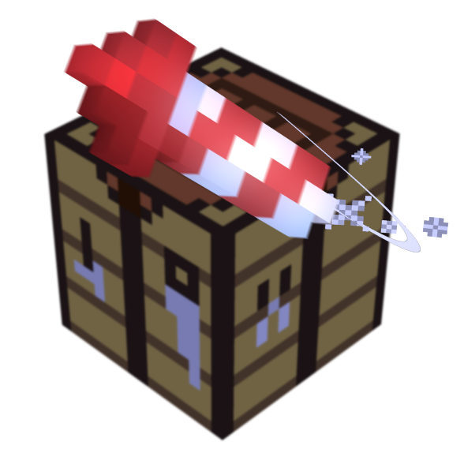

# Sparkles (v1.0)
[](http://forthebadge.com)
## What is it?

Sparkles is what I describe as a collection of tools to enhance the creation of pyrotechnical shows in the game.

> Over the last years, I've created plenty of events involving such shows. I started from "using simple firework /summon commands" to "creating a datapack spawning various amount of effects" (which are coordinated and synchronized to a piece of music).

\- JeffWooden

## Showcase

*Section under writing.*

## License
[Sparkles](https://www.planetminecraft.com/data-pack/sparkles-5572310/) © 2021 by [JeffWooden](https://www.planetminecraft.com/member/jeffwooden/) is licensed under [Attribution-NonCommercial 4.0 International](https://creativecommons.org/licenses/by-nc/4.0/)
If you wish to present this datapack, please make sure to provide appropriate credits like these:
```
Sparkles by JeffWooden
Link to the datapack projet: https://www.planetminecraft.com/data-pack/sparkles-5572310/
Creator Page: https://www.planetminecraft.com/member/jeffwooden/
```

## Documentation
This datapack requires some knowledge to be used properly. Please, check the [documentation](docs/main.md) for more information.